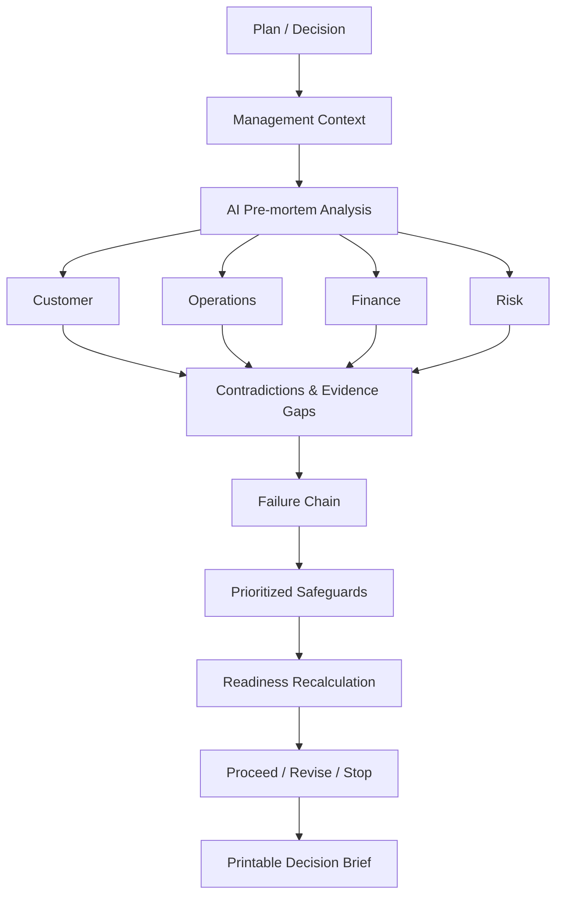

<div align="center">

# 🧭 FailureTwin AI

### See how your plan could fail before the real world finds out.

**AI pre-mortem decision workspace for founders, product managers, and operations teams.**

[](#-nativebuilder)
[](#-hackathon-focus)
[](#-project-status)
[](LICENSE)

</div>

---

## ✨ What is FailureTwin AI?

Most planning tools help teams describe how a plan could succeed. FailureTwin does the opposite.

It runs a structured **pre-mortem** before execution and asks:

> If this plan fails, what is the most plausible chain of events that caused it?

A user describes a launch, automation, product change, or business decision. FailureTwin stress-tests the plan through four independent perspectives:

| Perspective | Focus |
|---|---|
| 👥 **Customer** | adoption, trust, switching friction, support and user experience |
| ⚙️ **Operations** | capacity, dependencies, ownership, rollout and rollback readiness |
| 💰 **Finance** | budget, hidden cost, ROI, unit economics and downside exposure |
| 🛡️ **Risk** | security, privacy, compliance, reputation and critical failure modes |

FailureTwin then connects the findings into a failure chain, recommends safeguards, recalculates readiness, and produces a **Proceed / Revise / Stop** decision brief.

---

## 🚀 Core workflow



<details>
<summary><strong>🔎 What does one simulation produce?</strong></summary>

- Four perspective-specific analyses
- Context-specific failure modes
- Contradictions and unresolved evidence
- Connected failure chains
- Prioritized safeguards with effort/impact reasoning
- Readiness score changes as safeguards are accepted
- Final Proceed / Revise / Stop recommendation
- Printable decision brief

</details>

<details>
<summary><strong>🧪 Why keep a deterministic fallback?</strong></summary>

The primary product direction is model-driven freeform analysis. A deterministic path is retained as a resilience mechanism for demo continuity and API failure handling, not as a substitute for the AI analysis layer.

</details>

---

## 🧠 AI analysis design

FailureTwin is designed around **context-specific reasoning**, not generic risk templates.

The model layer should return a structured result similar to:

```json
{
  "customer": {},
  "operations": {},
  "finance": {},
  "risk": {},
  "failureChains": [],
  "safeguards": [],
  "unresolvedQuestions": [],
  "evidenceQuality": 0,
  "decision": "REVISE"
}
```

The product goal is for judges and users to provide **freeform plans**, while the system still produces a stable, explainable output contract.

See [`docs/AI_ANALYSIS_DESIGN.md`](docs/AI_ANALYSIS_DESIGN.md).

---

## 🧩 Product principles

- **Plan-specific over generic** — safeguards must reference the user's actual constraints.
- **Different perspectives, different reasoning** — Finance should not sound like Risk; Operations should not repeat Customer.
- **Traceable recommendations** — input → observed risk → safeguard → readiness effect.
- **Preserve user work** — back navigation must not erase simulation state.
- **Useful artifact at the end** — the decision brief should be printable and executive-readable.
- **Resilient demo path** — model/API failures should fail gracefully.

---

## 🏗 Native.Builder

FailureTwin AI is built primarily in **Native.Builder** and synchronized to GitHub for source control, documentation, issue tracking, QA, and team collaboration.

The GitHub repository is the engineering collaboration layer; the deployed Native.Builder application remains the primary hackathon product.

---

## 📌 Project status

| Area | Status |
|---|---|
| Core pre-mortem workflow | 🟢 Working / refinement |
| Four-perspective analysis | 🟡 AI-depth refinement |
| Freeform model-driven analysis | 🟡 Priority |
| Failure-chain experience | 🟡 UX refinement |
| Safeguard scoring | 🟢 Core behavior available |
| Navigation/state persistence | 🟡 Regression priority |
| Printable decision brief | 🟡 Final polish |
| Management Plan | 🟡 Planned enhancement |
| Evidence/file workflow | ⚪ Stretch / controlled scope |
| Documentation & QA | 🟢 In progress |

> Status descriptions intentionally distinguish implemented behavior from planned or refinement work.

---

## 🧪 Quality gates

Before submission, the team validates:

1. A new user can complete one full workflow without assistance.
2. Freeform input produces plan-specific analysis.
3. Customer, Operations, Finance and Risk outputs are meaningfully different.
4. Back/forward navigation preserves entered information.
5. Accepting a safeguard changes readiness exactly once.
6. The final decision is consistent with the visible evidence and score.
7. The public deployment works in a fresh browser session.
8. The demo can be completed cleanly within the event time limit.

See [`docs/TEST_PLAN.md`](docs/TEST_PLAN.md).

---

## 👥 Team & responsibility areas

| Member | Responsibility area |
|---|---|
| **Rama Chandra** | Product & Technical Lead · Native.Builder architecture · AI integration · scoring · final integration & release |
| **Aigbe Godspower Voke** | Full-stack workflow review · navigation/state QA · failure-chain UX validation |
| **Raff Fahrezi** | Management Plan · evidence/file workflow · data/Supabase review · security & privacy review |
| **Amna (Dreamy doodle)** | QA · documentation · safeguard-personalization review · perspective-differentiation review · demo support |
| **Salman** | repository onboarding · local setup validation · smoke testing · documentation validation |
| **s.env** | responsibility pending confirmed technical profile and agreed task ownership |

See [`docs/TEAM.md`](docs/TEAM.md).

---

## 🧭 Repository guide

```text
.
├── README.md
├── CONTRIBUTING.md
├── CHANGELOG.md
├── SECURITY.md
├── LICENSE
├── docs/
│   ├── PRODUCT_REQUIREMENTS.md
│   ├── ARCHITECTURE.md
│   ├── AI_ANALYSIS_DESIGN.md
│   ├── FAILURE_CHAIN_MODEL.md
│   ├── SCORING_MODEL.md
│   ├── TEST_PLAN.md
│   ├── TEAM.md
│   ├── MENTOR_FEEDBACK.md
│   ├── DEMO_SCRIPT.md
│   ├── JUDGING_ALIGNMENT.md
│   └── SUBMISSION_CHECKLIST.md
└── .github/
    ├── ISSUE_TEMPLATE/
    └── pull_request_template.md
```

---

## 🤝 Contributing

We use a lightweight professional workflow:

**Issue → branch → change → PR → review/test evidence → merge → issue close**

Please read [`CONTRIBUTING.md`](CONTRIBUTING.md) before starting work.

---

## 🎯 Hackathon focus

The final sprint prioritizes:

1. Genuine model-driven freeform analysis
2. Plan-specific and non-obvious failure modes
3. State-safe end-to-end workflow
4. Personalized safeguards
5. Strong printable decision brief
6. Clean short demo and stable public deployment

See [`docs/JUDGING_ALIGNMENT.md`](docs/JUDGING_ALIGNMENT.md).

---

## 📄 License

MIT — see [`LICENSE`](LICENSE).

---

<div align="center">

**FailureTwin AI** · Think through failure while failure is still cheap.

</div>
