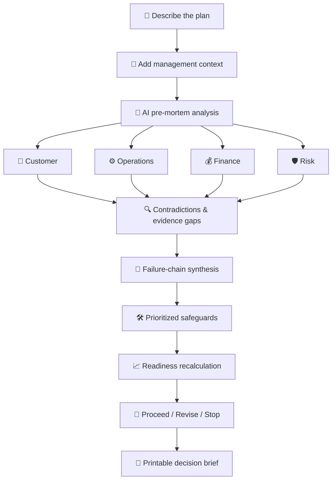
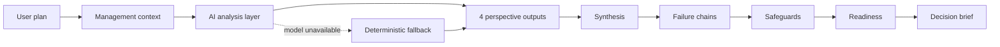
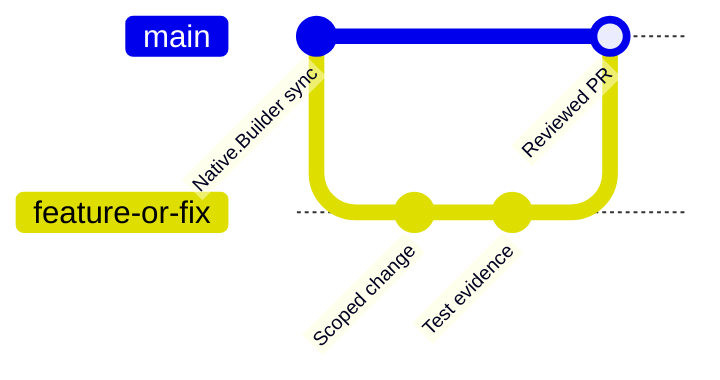

<div align="center">

# 🧭 FailureTwin AI

### **See how your plan could fail before the real world finds out.**

AI-powered pre-mortem decision intelligence for founders, product managers, operations teams, and builders making high-stakes product or business decisions.

<p>
  <a href="https://8dwt4gn8dlracgicnxgxaptj7.nativelyai.app/"><strong>🚀 Live App</strong></a>
  ·
  <a href="#-how-it-works"><strong>🧠 How It Works</strong></a>
  ·
  <a href="#-team"><strong>👥 Team</strong></a>
  ·
  <a href="#-documentation"><strong>📚 Documentation</strong></a>
  ·
  <a href="#-contributing"><strong>🤝 Contributing</strong></a>
</p>

<p>
  
  
  
  
</p>

</div>

---

## 🎯 The problem

Most planning tools help teams explain **how a plan might succeed**.

FailureTwin asks the uncomfortable but valuable question first:

> **If this plan fails, what chain of events most likely caused it?**

Teams commonly discover hidden assumptions, operational bottlenecks, customer friction, financial exposure, and rollback gaps only after launch. FailureTwin brings those failure modes forward while they are still cheap to fix.

---

## ✨ What FailureTwin does

A user describes a launch, automation, product change, operational decision, or business plan. FailureTwin stress-tests that plan through four independent analytical lenses:

| Lens | What it challenges |
|---|---|
| 👥 **Customer** | adoption, trust, switching friction, support impact, user expectations |
| ⚙️ **Operations** | capacity, dependencies, ownership, rollout, rollback, service continuity |
| 💰 **Finance** | budget realism, hidden cost, ROI, downside exposure, unit economics |
| 🛡️ **Risk** | security, privacy, compliance, reputation, critical blockers |

The results are synthesized into:

- 🔍 contradictions and evidence gaps
- 🔗 connected failure chains
- 🛠️ prioritized safeguards
- 📈 readiness changes
- ❓ unresolved questions
- 🧾 a printable **Proceed / Revise / Stop** decision brief

---

## 🧠 How it works



<details>
<summary><strong>🔎 What does a complete simulation produce?</strong></summary>

- four perspective-specific analyses
- context-specific and non-obvious failure modes
- contradictions and unresolved assumptions
- one or more causal failure chains
- safeguards tied back to specific risks
- readiness effects when safeguards are accepted
- final recommendation with supporting evidence
- printable decision summary

</details>

<details>
<summary><strong>🧪 Why keep a deterministic fallback?</strong></summary>

The product direction is **model-driven freeform analysis as the primary path**. A deterministic path is retained only as a resilience mechanism for model/API failure and demo continuity.

</details>

---

## 🧩 Core product principles

- **Plan-specific over generic** — analysis should use the user's actual constraints.
- **Distinct perspectives** — Customer, Operations, Finance, and Risk should not repeat the same template.
- **Traceable reasoning** — plan fact → failure mode → failure chain → safeguard → readiness effect.
- **Preserve work** — normal back/forward navigation must not erase simulation state.
- **Decision-oriented output** — the final artifact should be understandable by an executive in minutes.
- **Graceful degradation** — model or network failure should not destroy the workflow.

---

## 🤖 AI analysis contract

The UI is designed around a stable structured response contract such as:

```json
{
  "customer": {
    "findings": [],
    "confidence": 0
  },
  "operations": {
    "findings": [],
    "confidence": 0
  },
  "finance": {
    "findings": [],
    "confidence": 0
  },
  "risk": {
    "findings": [],
    "confidence": 0
  },
  "contradictions": [],
  "failureChains": [],
  "safeguards": [],
  "unresolvedQuestions": [],
  "evidenceQuality": 0,
  "decision": "REVISE"
}
```

See **[AI Analysis Design](docs/AI_ANALYSIS_DESIGN.md)** for reasoning requirements and fallback behavior.

---

## 🏗 Architecture



Native.Builder remains the primary product-building environment. GitHub provides the engineering collaboration layer for source synchronization, documentation, issue tracking, QA evidence, reviews, and release coordination.

---

## 🚦 Project status

| Area | Status | Current focus |
|---|---:|---|
| Core pre-mortem workflow | 🟢 | end-to-end refinement |
| Four-perspective analysis | 🟡 | increase perspective differentiation |
| Model-driven freeform analysis | 🟡 | highest-priority AI integration |
| Failure-chain synthesis | 🟡 | improve clarity and traceability |
| Safeguard scoring | 🟢/🟡 | regression validation |
| State persistence / back navigation | 🟡 | active reliability priority |
| Printable decision brief | 🟡 | final presentation polish |
| Management Plan | 🟡 | state + workflow refinement |
| Evidence/file workflow | ⚪ | controlled stretch scope |
| Documentation & QA | 🟢 | active |

> Statuses deliberately distinguish implemented behavior from active refinement and planned stretch work.

---

## 👥 Team

FailureTwin AI is a five-member hackathon team. Links below point to each member's GitHub profile.

| Member | Profile | Responsibility / contribution focus |
|---|---|---|
| **Rama Chandra** | [@kaulastudies](https://github.com/kaulastudies) | Product & Technical Lead · Native.Builder architecture · integration · scoring oversight · release/submission |
| **Aigbe Godspower Voke** | [@Gprexxy42](https://github.com/Gprexxy42) | Full-stack workflow review · navigation/state QA · failure-chain UX validation |
| **Raff Fahrezi** | [@CeriwitSawit](https://github.com/CeriwitSawit) | Management Plan · evidence/file workflow · Supabase/data review · security/privacy review |
| **Amna Rauf** | [@amna-rauf](https://github.com/amna-rauf) | QA · documentation · safeguard-personalization review · perspective differentiation · presentation/demo support |
| **Muhammad Salman** | [@SalmanDeveloperz](https://github.com/SalmanDeveloperz) | AI integration · backend/Supabase · four-perspective analysis · failure-chain generation · scoring · state persistence |

> The table represents agreed responsibility and review areas. GitHub issues, QA evidence, documentation changes, reviews, and code contributions provide the auditable contribution trail.

---

## 🧪 Quality gates

Before submission, the team validates that:

- [ ] a fresh user can finish one complete workflow without assistance
- [ ] arbitrary freeform input produces plan-specific output
- [ ] the four perspectives are materially different
- [ ] navigation preserves entered and derived state
- [ ] safeguards are tied to the user's actual plan
- [ ] accepting a safeguard changes readiness exactly once
- [ ] the final decision is consistent with visible evidence and score
- [ ] the public deployment works in a fresh browser session
- [ ] model/API failure has a graceful recovery/fallback path
- [ ] the final demo fits the event time requirement

See the full **[Test Plan](docs/TEST_PLAN.md)**.

---

## 📚 Documentation

| Document | Purpose |
|---|---|
| [Product Requirements](docs/PRODUCT_REQUIREMENTS.md) | target users, workflow, scope and acceptance criteria |
| [Architecture](docs/ARCHITECTURE.md) | product flow, AI/fallback boundary and state responsibilities |
| [AI Analysis Design](docs/AI_ANALYSIS_DESIGN.md) | structured output contract and perspective requirements |
| [Failure Chain Model](docs/FAILURE_CHAIN_MODEL.md) | causal chain design and intervention logic |
| [Scoring Model](docs/SCORING_MODEL.md) | readiness principles and scoring verification |
| [Test Plan](docs/TEST_PLAN.md) | P0 workflow and regression tests |
| [Team](docs/TEAM.md) | team profiles and responsibility areas |
| [Mentor Feedback](docs/MENTOR_FEEDBACK.md) | mentor observations and resulting priorities |
| [Judging Alignment](docs/JUDGING_ALIGNMENT.md) | evidence mapped to judging dimensions |
| [Demo Script](docs/DEMO_SCRIPT.md) | concise end-to-end presentation flow |
| [Submission Checklist](docs/SUBMISSION_CHECKLIST.md) | final product, repo and demo gates |
| [Security Policy](SECURITY.md) | secret handling and sensitive-data guidance |
| [Contributing](CONTRIBUTING.md) | issue → branch → PR → review workflow |

---

## 🗂 Repository workflow



We use:

**Issue → branch → implementation/QA/docs → PR → review/test evidence → merge → close**

Code is not the only valid contribution. Reproducible QA, test evidence, specifications, security reviews, documentation, UX reviews, and demo work are tracked as first-class project contributions.

---

## 🤝 Contributing

1. Pick or receive a GitHub issue.
2. Confirm the intended approach when the task is non-trivial.
3. Create a focused branch.
4. Make one coherent change.
5. Add test or review evidence.
6. Open a PR linked to the issue.
7. Validate before merge.

Read **[CONTRIBUTING.md](CONTRIBUTING.md)** before starting.

---

## 🎬 Demo narrative

A strong demo shows:

1. a realistic freeform plan
2. four differentiated perspectives
3. one non-obvious failure mode
4. a clear failure chain
5. safeguard acceptance
6. readiness change
7. the final decision brief

See **[docs/DEMO_SCRIPT.md](docs/DEMO_SCRIPT.md)**.

---

## 🔐 Security & privacy

FailureTwin may process business-sensitive planning context.

- never commit API keys or service-role credentials
- keep secrets in environment variables
- avoid unnecessary retention of uploaded evidence
- use least-privilege access to external services
- never publish sensitive business plans as demo data

See **[SECURITY.md](SECURITY.md)**.

---

## 📄 License

MIT — see **[LICENSE](LICENSE)**.

---

<div align="center">

### 🧭 FailureTwin AI

**Think through failure while failure is still cheap.**

[🚀 Open the live app](https://8dwt4gn8dlracgicnxgxaptj7.nativelyai.app/)

</div>
