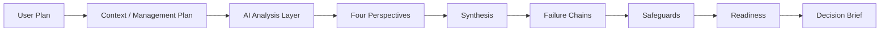
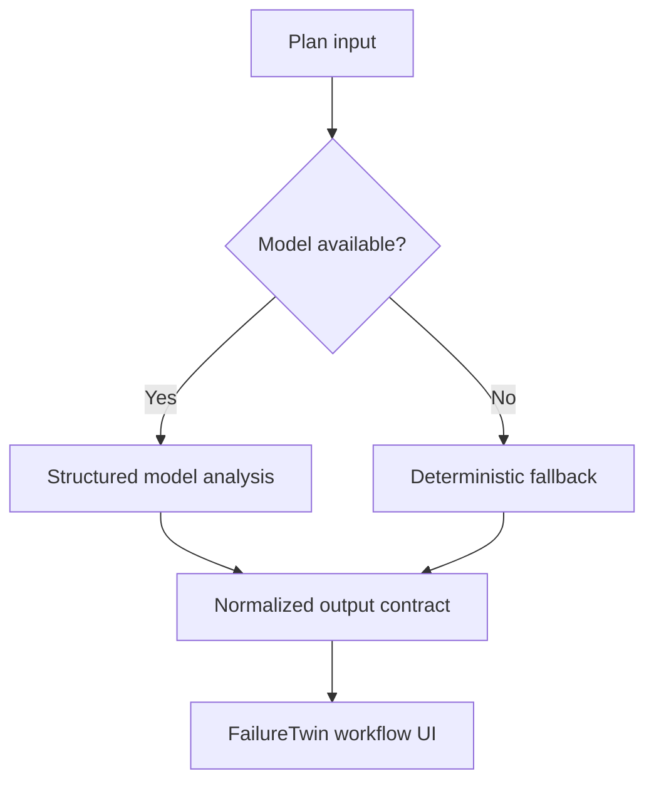

# Architecture

## Product architecture

## Reliability model

The target architecture uses a model-driven analysis path as the normal mode and a deterministic fallback only when the model path is unavailable.

## State
Workflow state should survive ordinary route changes and back navigation. Persist only the minimum required information.

## GitHub / Native.Builder
- Native.Builder remains the primary hackathon build environment.
- GitHub is used for source synchronization, documentation, issues, QA and team collaboration.
- Changes that materially alter the hackathon application should be synchronized carefully to avoid overwriting a newer Builder state.
