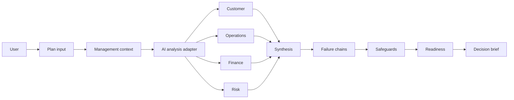
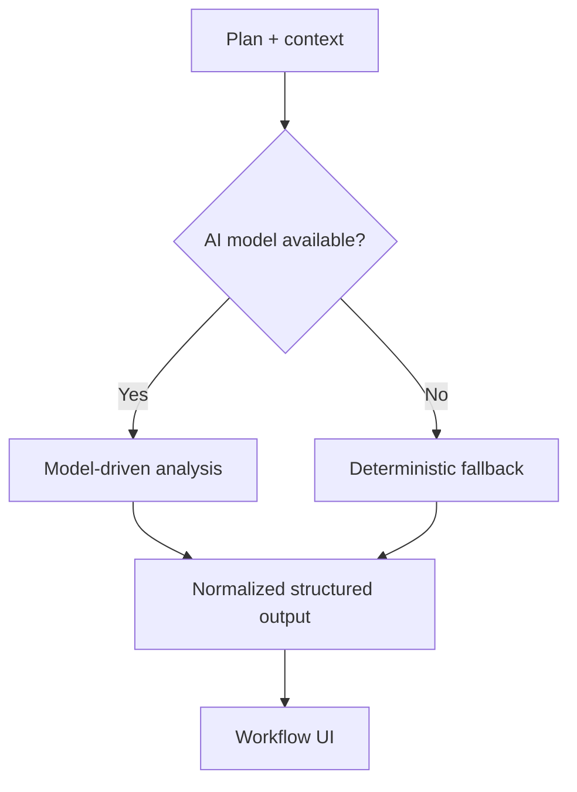

# Architecture

## System view

## Primary + fallback design

The intended primary path is model-driven reasoning. The deterministic path is a resilience mechanism rather than the product's primary intelligence layer.

## State responsibility
Workflow state should preserve:
- plan/context input
- analysis result
- failure chains
- safeguards
- accepted/rejected decisions
- readiness
- final recommendation

Persist only what is required for user continuity.

## Native.Builder + GitHub
Native.Builder is the main hackathon build environment. GitHub is used for:
- source synchronization
- documentation
- issue tracking
- QA evidence
- PR review
- release/submission coordination
