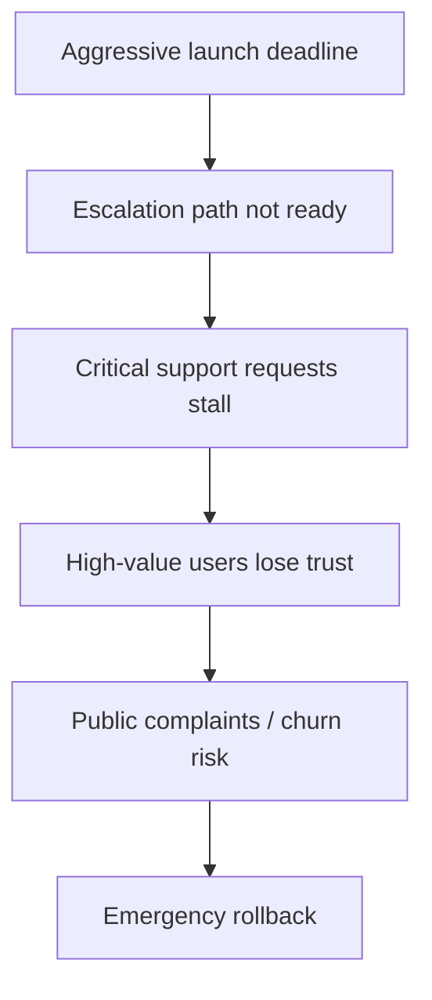

# Failure Chain Model

A failure chain connects individual weaknesses into a causal sequence.

## Example

## Requirements
- every chain node should be grounded in user context or an explicit inference
- chains should explain causality rather than group unrelated risks
- safeguards should interrupt one or more specific nodes
- the strongest chain should be explainable quickly in a demo
- chain changes should be traceable when new evidence or safeguards are added
