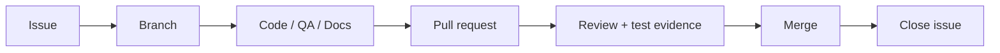

# 👥 FailureTwin AI — Team

FailureTwin AI is a five-member hackathon team. This document records verified GitHub identities plus agreed responsibility/review areas.

| Member | GitHub | Responsibility / review area |
|---|---|---|
| **Rama Chandra** | [@kaulastudies](https://github.com/kaulastudies) | Product & Technical Lead; Native.Builder architecture; integration; scoring oversight; final release and submission |
| **Aigbe Godspower Voke** | [@Gprexxy42](https://github.com/Gprexxy42) | Full-stack workflow review; navigation/state QA; failure-chain UX validation |
| **Raff Fahrezi** | [@CeriwitSawit](https://github.com/CeriwitSawit) | Management Plan; evidence/file workflow; Supabase/data review; security and privacy review |
| **Amna Rauf** | [@amna-rauf](https://github.com/amna-rauf) | QA; documentation; safeguard-personalization review; perspective differentiation; presentation/demo support |
| **Muhammad Salman** | [@SalmanDeveloperz](https://github.com/SalmanDeveloperz) | AI integration; backend/Supabase; four-perspective analysis; failure-chain generation; scoring; state-persistence engineering |

## Collaboration standard

The repository tracks contribution through work actually performed:

- implementation commits and PRs
- reproducible bug reports
- test plans and regression evidence
- feature specifications and acceptance criteria
- security/privacy reviews
- UX/workflow reviews
- documentation
- demo and submission work
- PR reviews

Responsibility assignment is not presented as authorship of code that has not been written by that member.

## GitHub collaboration flow

